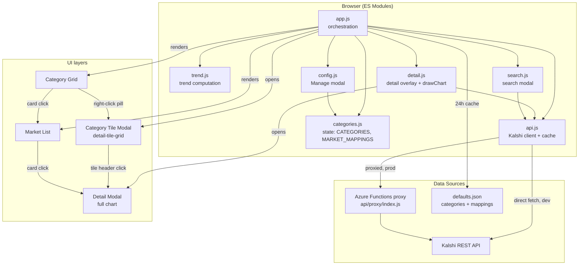

# World Pulse

A dashboard tracking prediction market prices as signals for macro-scale narratives — climate, geopolitics, technology, health, and more. Built on [Kalshi](https://kalshi.com) trade data.

## What it does

- Organises prediction markets into narrative categories (e.g. "AI Takeover", "End of the World")
- Highlights markets that are **actively trending** toward their narrative
- Sparkline charts show recent price movement at a glance
- Click a **category card** to filter the market list and open the tile modal (a grid of full chart panels)
- Click any **market row** for a full-screen historical price chart with time-range selectors (1H → ALL)
- Fully configurable — add/remove categories and market mappings without touching code

## Architecture



### Data flow

1. On load, `app.js` fetches `defaults.json` (24 h cache) → calls `initDefaults` to populate mutable state in `categories.js`.
2. `fetchAllMarkets` calls `api.js → getMarkets(tickers)` (15 min localStorage cache).  
   On production, requests route through the Azure Functions CORS proxy.
3. `trend.js → getTrendingByCategory` computes which markets are trending *toward* their narrative using recent trade deltas and the per-mapping `direction` flag.
4. The category grid and market list are re-rendered synchronously. Sparkline charts are fetched in parallel in the background (50 trades each).
5. Opening a detail overlay or category tile modal triggers a fresh 500-trade fetch for each visible market.

## Running locally

```bash
python3 -m http.server 8080
# open http://localhost:8080
```

No build step. Pure ES modules served directly. The Kalshi API is called directly from localhost (no proxy needed — CORS is open for direct requests).

## Deploying

Hosted on Azure Static Web Apps. Push to `main` → GitHub Actions builds and deploys automatically.

An Azure Functions proxy (`api/proxy`) forwards API calls on deployed environments where Kalshi blocks CORS from non-localhost origins.

The build pipeline auto-generates `version.json` from `github.run_number` and the current git SHA, displayed in the footer.

## Configuring markets

**No code changes needed.** Edit `defaults.json` at the repo root:

```json
{
  "categories": [
    { "id": "ai", "name": "AI Takeover", "emoji": "🤖", "description": "..." }
  ],
  "mappings": [
    { "ticker": "KXAGICO-COMP-27Q1", "categoryId": "ai", "direction": 1, "title": "AGI achieved by Q1 2027" }
  ]
}
```

- `direction: 1` — rising price supports the narrative
- `direction: -1` — falling price supports the narrative
- `title` — human-readable label shown in the UI and search

Push the change. The dashboard picks up the new defaults on next load (24h cache, or on hard refresh).

### In-browser customisation

The **💼 Manage** button opens a panel to add/remove categories and mappings without deploying. Changes are saved to `localStorage` and layered on top of `defaults.json`. "Restore all defaults" undoes any hidden defaults while keeping user additions.

## File structure

```
defaults.json          — default categories and market mappings
index.html             — single-page shell
style.css              — all styles
js/
  app.js               — orchestration, rendering, data flow
  api.js               — Kalshi API client, caching, mock fallback
  categories.js        — mutable CATEGORIES and MARKET_MAPPINGS state
  trend.js             — trend computation and filtering logic
  search.js            — search modal and add-to-category flow
  detail.js            — market detail overlay + shared drawChart
  config.js            — Manage modal (categories + mappings UI)
api/
  proxy/index.js       — Azure Functions CORS proxy
```

## Data

- Market prices update every 15 minutes (localStorage cache)
- `defaults.json` is cached for 24 hours
- If the Kalshi API is unreachable, the dashboard falls back to simulated data (labelled clearly)
